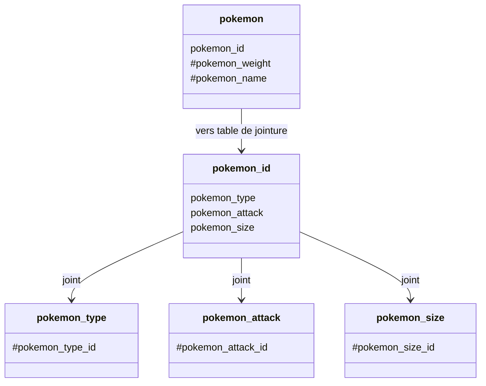
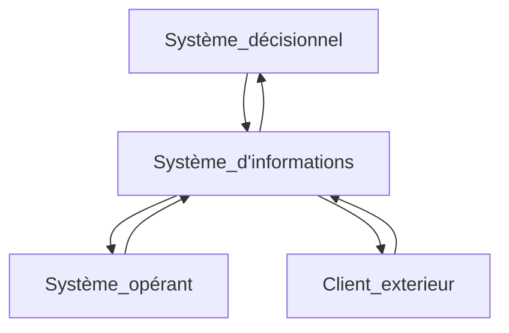
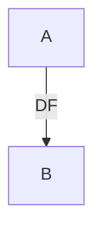
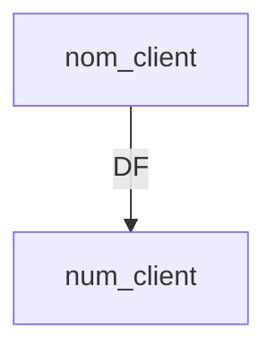
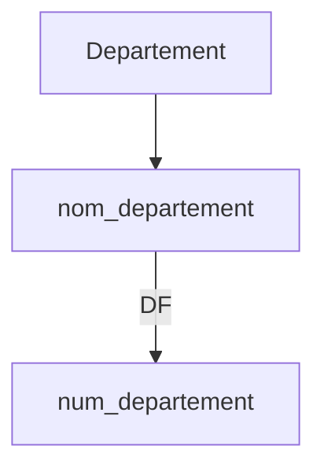
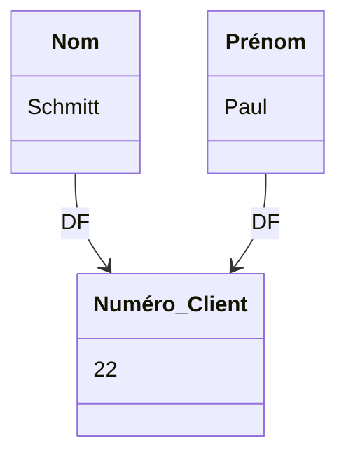
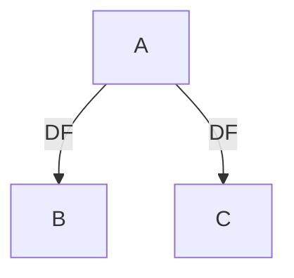
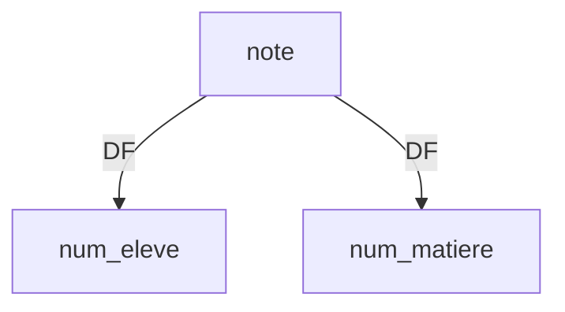

# Base de données SQL

## Exemple d'une base de donnée

### Fiche Client

- n° Client (47) (**Clé primaire**)
- Nom
- Prénom
- Adresse
- Id commercial : (4) (**Clé etrangère**)

### Fiche commercial

- n° Commercial : (4) (**Clé primaire**)
- id type : (5)

### Fiche type

- type : (5) (_On peux utiliser un **ID** pour définir quel est le type du client (5 pour pro) (3 pour casual) etc ..._)
- Professionel

_exemple d'une base de donnée:_

## Table de jointure

Une table de jointure permet de faire le lien entre plusieurs table d'une base de donnée , elle est généralement composée de plusieurs clé primaire

_exemple:_

## Système

Definition d'un système :

- Avoir un certain nombre d'elements
- Comment sont t'il interconnécté les uns les autres

_exemple de système:_

## Type de données traitées

- **Entier (Integer):** Représente les nombres entiers sans décimales.

- **Décimal (Decimal/Float):** Utilisé pour stocker des nombres à virgule flottante, c'est-à-dire des nombres avec des parties décimales.

- **Caractère (Character/String):** Utilisé pour stocker des séquences de caractères, telles que du texte, des mots ou des phrases.

- **Date/Heure (Date/Time):** Permet de stocker des informations liées à la date et à l'heure.

- **Booléen (Boolean):** Représente une valeur de vérité, généralement vrai ou faux (true or false).

- **Binaire (Binary):** Utilisé pour stocker des données binaires, comme des images, des fichiers, etc.

- **Clé primaire (Primary Key):** Un identifiant unique pour chaque enregistrement dans une table.

- **Clé étrangère (Foreign Key):** Utilisée pour établir une relation entre deux tables. Elle fait référence à la clé primaire d'une autre table.

- **Texte (Text):** Similaire au type de données "Character", mais peut stocker une plus grande quantité de texte.

- **Liste/Ensemble (List/Set):** Utilisé pour stocker des collections d'éléments.

- **JSON (JavaScript Object Notation):** Un format de données léger et facile à lire, souvent utilisé pour représenter des objets et des structures de données complexes.

- **XML (eXtensible Markup Language):** Un langage de balisage utilisé pour stocker et transporter des données structurées.

## Matrice des dépendances fonctionnelles

Tout le fonctionnement d'une base de donnée opérationnelle dépend d'une matrice de dépendances fonctionnelle.

On dit que **A** , est en dépendance fonctionnelle (DF) par rapport à **B** , si à une valeur de **B** ne correspond au maximum qu'une valeur de **A**.
On considère que la réciproque est fausse.

On dit que **nom_client** est en dépendance fonctionnelle (DF) par rapport à **num_client** , si à a une valeur de **num_client** ne correspond au maximum qu'une valeur de **nom_client**.
On considère que la réciproque est fausse.

_Exemple:_

Si l'on demande le nom du département (Moselle) , la réponse sera 57
Par contre si l'on demande le numéro du département (57) il n'y aura pas de réponses.

**Base de donnée magasin**

Le moyen de relier **Nom** et **Prénom** de manière unique est une dépendance fonctionnelle à **Numéro_Client**
Ca évite de fonctionner par filtre **Nom** --> **Prénom** --> **Ville** --> **Age**

**tableau de dépendances fonctionnelles**

| Entités     | Dépendances fonctionnelles                                   |
| ----------- | ------------------------------------------------------------ |
| Utilisateur | **NomUtilisateur** -> AdresseEmail, MotDePasse               |
| Commande    | **NumCommande** -> DateCommande, MontantTotal, UtilisateurID |
| Article     | **CodeArticle** -> Designation, PrixUnitaire                 |
| Adresse     | **CodePostal** -> Ville, Region, Pays                        |
| Commentaire | **UtilisateurID, NumCommande** -> TexteCommentaire           |

## Dépendances fonctionnelles composées

On dit que A est en DF par rapport à B et C , si à une valeur de B et à une valeur de C , ne correspond au maximum qu'une valeur de A.

