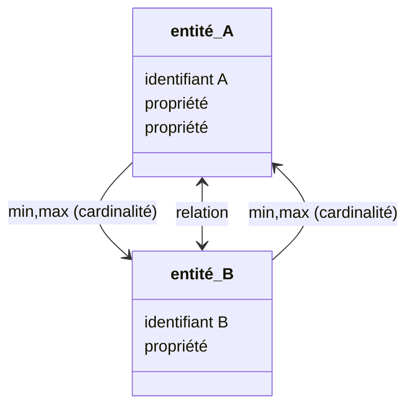
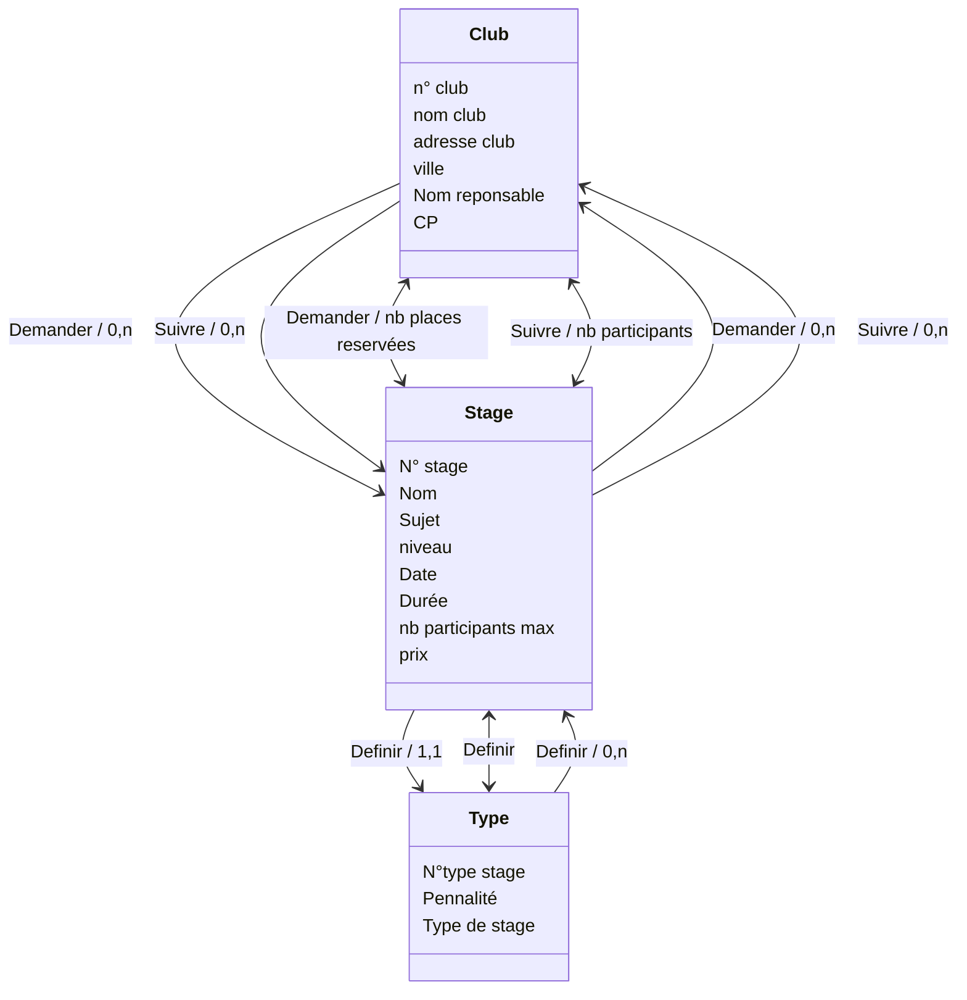

# MCD : Model conceptuel des données



**`Cardinalités définition:`**

Dans le modèle Merise, la cardinalité représente le nombre d'occurrences d'une entité liée à une autre dans une relation. Elle indique la quantité d'instances d'une entité associée à une instance de l'entité source. On utilise souvent les termes "1" (un) pour indiquer une relation obligatoire et "0, n" pour signifier une relation optionnelle avec "n" instances possibles. La cardinalité est cruciale pour définir la nature et la force des liens entre les entités dans le schéma conceptuel d'une base de données.

**`Relation définition:`**

Dans le modèle Merise, les relations décrivent les associations entre entités et déterminent comment ces entités interagissent. Les relations peuvent être de trois types : association, spécialisation/généralisation, et dépendance fonctionnelle. Chacune de ces relations joue un rôle spécifique dans la modélisation conceptuelle des données. L'association définit les liens entre entités, la spécialisation/généralisation représente les hiérarchies entre entités, et la dépendance fonctionnelle établit des relations d'attribution de données. Ces relations sont essentielles pour définir la structure et le comportement des données dans le schéma conceptuel de Merise.

**`Exemple MCD exercice Club:`**



**`Exemple d'un MCD`**


**`Exemple MCD CLUB DE GOLF`**


**`Exemple MCD en MLD CLUB DE GOLF`**


**`Exemple SQL CLUB DE GOLF`**

```sql
CREATE TABLE CLUB(
   num_club INT AUTO_INCREMENT,
   nom_club VARCHAR(50) ,
   adresse_club VARCHAR(50) ,
   ville_club VARCHAR(50) ,
   reponsable_club VARCHAR(50) ,
   cp_club VARCHAR(50) ,
   PRIMARY KEY(num_club)
);

CREATE TABLE TYPE_STAGE(
   num_type_stage INT AUTO_INCREMENT,
   type_stage VARCHAR(50) ,
   pénalité VARCHAR(50) ,
   PRIMARY KEY(num_type_stage)
);

CREATE TABLE STAGE(
   num_stage INT AUTO_INCREMENT,
   date_stage DATE,
   nom_stage VARCHAR(50) ,
   niveau_stage VARCHAR(50) ,
   prix_stage DECIMAL(8,2)  ,
   durée_stage INT,
   participants_max INT,
   sujet_stage VARCHAR(50) ,
   num_type_stage INT NOT NULL,
   PRIMARY KEY(num_stage),
   FOREIGN KEY(num_type_stage) REFERENCES TYPE_STAGE(num_type_stage)
);

CREATE TABLE PARTICIPER(
   num_club INT,
   num_stage INT,
   participants INT,
   PRIMARY KEY(num_club, num_stage),
   FOREIGN KEY(num_club) REFERENCES CLUB(num_club),
   FOREIGN KEY(num_stage) REFERENCES STAGE(num_stage)
);

CREATE TABLE RESERVER(
   num_club INT,
   num_stage INT,
   place_réservés INT,
   PRIMARY KEY(num_club, num_stage),
   FOREIGN KEY(num_club) REFERENCES CLUB(num_club),
   FOREIGN KEY(num_stage) REFERENCES STAGE(num_stage)
);

```
