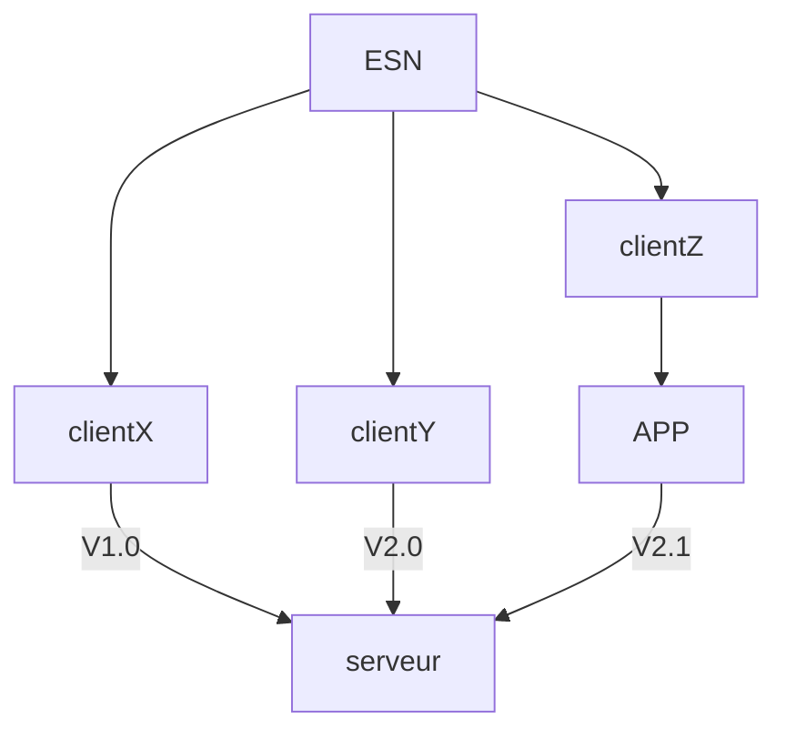

# Versioning

## Definition

Le versioning fait référence à la gestion des différentes versions d'un logiciel, d'un fichier, ou d'un projet. Il s'agit d'un processus qui permet de suivre les modifications apportées au fil du temps, d'organiser les différentes versions, et de faciliter la collaboration entre plusieurs personnes travaillant sur le même projet. Le versioning est largement utilisé dans le développement de logiciels, la gestion de projets, et même dans le domaine du contenu multimédia.

Il existe différents systèmes de versioning, notamment le versioning centralisé et le versioning décentralisé. Parmi les outils de versioning les plus couramment utilisés, on trouve Git, Mercurial, Subversion, et d'autres.

L'utilisation d'un système de versioning permet de garder une trace des modifications apportées, de revenir à des versions antérieures si nécessaire, de gérer les conflits entre les modifications concurrentes, et de faciliter la collaboration en permettant à plusieurs personnes de travailler simultanément sur un même projet sans risque de pertes de données.

**`Exemple :`**

