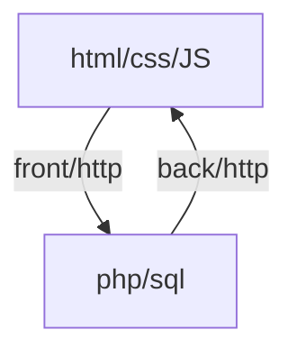

# Intro php



**syntaxe**

```php
// exemple de syntaxe
$maVariable2 = 42 ;
$maVariable2 = true;
if ($maVariable2 == 42) {
    //code
} else {
    //code
}
```

```php
// boucle
for ($ i = 0; $i<=10;$i++) {
    //code
}
$j = 0;
while ($j< 10) {
    $j++;
}
```
