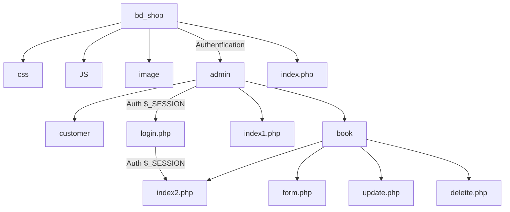

# Création d'un CRUD

## Définition

Le **CRUD** est un acronyme qui représente les **quatre opérations de base** pour la **gestion de la persistance des données** dans les applications informatiques. Voici ce que chaque lettre signifie:

1. **C** (Create) : Créer de nouvelles données.
2. **R** (Read) : Lire ou récupérer des données existantes.
3. **U** (Update) : Mettre à jour ou modifier des données existantes.
4. **D** (Delete) : Supprimer des données.

En d'autres termes, le CRUD résume les fonctions essentielles qu'un utilisateur doit utiliser pour **créer et gérer des données**. Ces opérations sont couramment utilisées dans la **gestion des bases de données** et le développement d'applications. Par exemple, pour un utilisateur, CRUD peut signifier la **création d'un compte**, la **lecture des informations**, la **mise à jour des détails** ou encore la **suppression d'un enregistrement**¹⁴.

(1) CRUD : les opérations de base de données les plus importantes - IONOS. https://www.ionos.fr/digitalguide/sites-internet/developpement-web/crud-les-operations-de-base-de-donnees-les-plus-importantes/.

(2) CRUD — Wikipédia. https://fr.wikipedia.org/wiki/CRUD.

(3) Create, read, update and delete - Wikipedia. https://en.wikipedia.org/wiki/Create,_read,_update_and_delete.

(4) CRUD Operations – What is CRUD? - freeCodeCamp.org. https://www.freecodecamp.org/news/crud-operations-explained/.

## Sécurisation d'un CRUD

**Arborescence d'un dossier type :**



**Chifrement** 

```mermaid

graph

mdp --> |1234| MD5
MD5 --> chiffrement --> |@XZ1#?!| MDPchiffré 

```

// ! Aucun mot de passe en clair dans la BDD  ! //

## Chiffrement 

**fonction php de chiffrement :**

```php
<?php
    password_hash();
?>
```

**fonction php de lecture**

```php
<?php
    password_verify();
?>
```

**Exemple :**

Bien sûr ! Voici un exemple d'utilisation des fonctions `password_hash()` et `password_verify()` en **PHP** pour gérer les mots de passe de manière sécurisée. Je vais le présenter en **markdown** pour plus de clarté :

1. **Création d'un mot de passe hashé** (utilisation de `password_hash()`):
   ```php
   <?php
   // Récupération du mot de passe depuis un formulaire (par exemple)
   $userPassword = $_POST['password'];

   // Hashage du mot de passe
   $hashedPassword = password_hash($userPassword, PASSWORD_DEFAULT);

   // Stockage du mot de passe hashé dans la base de données
   // (Assurez-vous que la colonne de stockage est suffisamment grande pour contenir le hash, au moins 60 caractères)
   // ...
   ?>
   ```

2. **Vérification d'un mot de passe** (utilisation de `password_verify()`):
   ```php
   <?php
   // Récupération du mot de passe entré par l'utilisateur lors de la connexion
   $userInputPassword = $_POST['login_password'];

   // Récupération du mot de passe hashé depuis la base de données (par exemple)
   $storedHashedPassword = getHashedPasswordFromDatabase($username); // Remplacez par votre propre logique

   // Vérification du mot de passe
   if (password_verify($userInputPassword, $storedHashedPassword)) {
       // Le mot de passe est valide, vous pouvez authentifier l'utilisateur
       // ...
   } else {
       // Le mot de passe ne correspond pas, redirigez vers la page de connexion
       // ...
   }
   ?>
   ```
 Les fonctions `password_hash()` et `password_verify()` sont des moyens recommandés pour stocker et vérifier les mots de passe en toute sécurité¹²³⁴⁵.

(1) How to use PHP's password_hash to hash and verify passwords. https://stackoverflow.com/questions/30279321/how-to-use-phps-password-hash-to-hash-and-verify-passwords.

(2) PHP password_verify - PHP Tutorial. https://www.phptutorial.net/php-tutorial/php-password_verify/.

(3) hash - PHP password_verify() - Stack Overflow. https://stackoverflow.com/questions/39787925/php-password-verify.

(4) Password_verify - PHP - W3cubDocs. https://docs.w3cub.com/php/function.password-verify.html.

(5) PHP: password_verify - Manual. https://www.php.net/manual/en/function.password-verify.php.

## Variables de session 

Les **variables de session en PHP** sont utilisées pour stocker des informations utilisateur sur le serveur, afin de les réutiliser ultérieurement. Voici quelques points clés à retenir :

- **Création d'une nouvelle session** :
  - Pour démarrer une session, utilisez `session_start()`.
  - Par exemple :
    ```php
    <?php
    session_start();
    $_SESSION["newsession"] = $valeur;
    ?>
    ```

- **Récupération d'une session existante** :
  - Utilisez également `session_start()` pour accéder aux variables de session.
  - Par exemple :
    ```php
    <?php
    session_start();
    $valeur = $_SESSION["newsession"];
    echo $valeur;
    ?>
    ```

- **Mise à jour d'une session** :
  - Modifiez la valeur d'une variable de session existante.
  - Par exemple :
    ```php
    <?php
    session_start();
    $_SESSION["newsession"] = $nouvelle_valeur;
    ?>
    ```

- **Suppression d'une session** :
  - Utilisez `unset()` pour supprimer une variable de session.
  - Par exemple :
    ```php
    <?php
    session_start();
    unset($_SESSION["newsession"]);
    ?>
    ```

Les variables de session sont utiles pour stocker des informations spécifiques à un utilisateur tout au long de sa session de navigation sur un site web¹²³⁴.

(1) PHP: $_SESSION - Manual. https://www.php.net/manual/fr/reserved.variables.session.php.

(2) Understanding PHP Session Variables: Best Practices and Use Cases. https://backlinkworks.com/blogs/understanding-php-session-variables-best-practices-and-use-cases/.
(3) PHP Sessions - W3Schools. https://www.w3schools.com/php/php_sessions.asp.

(4) Définir et utiliser les sessions en PHP - Pierre Giraud. https://www.pierre-giraud.com/php-mysql-apprendre-coder-cours/session-definition-utilisation/.

**Durée des variables de session**

La **durée d'une variable de session en PHP** dépend de la configuration et du contexte. Voici quelques points importants à retenir :

1. **Durée par défaut** :
   - Par défaut, les variables de session en PHP durent **jusqu'à ce que l'utilisateur ferme son navigateur**.
   - Cela signifie que tant que l'utilisateur reste sur le site web, les variables de session restent actives.
   - Elles sont stockées côté serveur et sont disponibles pour toutes les pages de l'application pendant la session³.

2. **Configuration personnalisée** :
   - Vous pouvez **modifier la durée d'une session** en ajustant certains paramètres.
   - Le paramètre clé est `session.gc_maxlifetime`, qui définit la durée maximale de vie d'une session en **secondes**.
   - Par exemple, pour expirer une variable de session après **30 minutes d'inactivité**, vous pouvez configurer `session.gc_maxlifetime` dans votre fichier `php.ini`².
   - Voici comment vous pouvez le faire en code :
     ```php
     <?php
     // Définir la durée maximale de vie d'une session à 1 heure (3600 secondes)
     ini_set('session.gc_maxlifetime', 3600);

     // Définir la durée de validité du cookie de session à 1 heure
     session_set_cookie_params(3600);

     // Démarrer la session
     session_start();
     ?>
     ```

3. **Gestion manuelle** :
   - Si vous avez besoin d'une gestion plus précise, vous pouvez implémenter votre propre logique pour détruire une session après un certain temps d'inactivité.
   - Par exemple, en vérifiant le temps écoulé depuis la dernière interaction de l'utilisateur et en détruisant la session si nécessaire⁴.

En résumé, la durée d'une variable de session dépend de la configuration du serveur, mais vous pouvez la personnaliser en utilisant les paramètres appropriés ou en implémentant votre propre logique de gestion des sessions¹²³⁴.

(1) PHP Sessions - W3Schools. https://www.w3schools.com/php/php_sessions.asp.

(2) PHP - set session variable to expire after 30 minutes. https://www.learnphp.org/php-set-session-variable-to-expire-after-30-minutes.

(3) How to change the session timeout in PHP? - GeeksforGeeks. https://www.geeksforgeeks.org/how-to-change-the-session-timeout-in-php/.

(4) How to change the session timeout in PHP? - Stack Overflow. https://stackoverflow.com/questions/8311320/how-to-change-the-session-timeout-in-php.