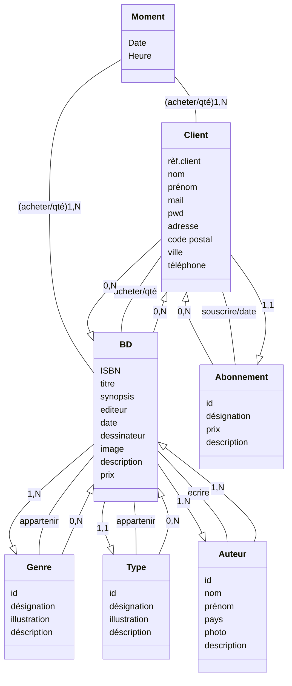

# MCD BD bdd

```mermaid
classDiagram

BD : ISBN
BD : titre
BD : synopsis
BD : editeur
BD : date
BD : dessinateur
BD : image
BD : description
BD : prix

Client : rèf.client
Client : nom
Client : prénom
Client : mail
Client : pwd
Client : adresse
Client : code postal
Client : ville
Client : téléphone

Abonnement : id
Abonnement : désignation
Abonnement : prix
Abonnement : description

Genre : id
Genre : désignation
Genre : illustration
Genre : déscription

Type : id
Type : désignation
Type : illustration
Type : déscription

Auteur : id
Auteur : nom
Auteur : prénom
Auteur : pays
Auteur : photo
Auteur : description

BD <|-- Genre : 0,N
BD -- Genre : appartenir
BD --|> Genre : 1,N

BD <|--Type : 0,N
BD -- Type : appartenir
BD --|> Type : 1,1

BD <|-- Auteur : 1,N
BD -- Auteur : ecrire
BD --|> Auteur : 1,N

Client --|> Abonnement : 1,1
Client -- Abonnement : souscrire/date
Client <|-- Abonnement : 0,N

Client <|-- BD : 0,N
Client -- BD : acheter/qté
Client --|> BD : 0,N

Moment -- BD : (acheter/qté)1,N
Moment -- Client : (acheter/qté)1,N
Moment : Date
Moment : Heure

```
